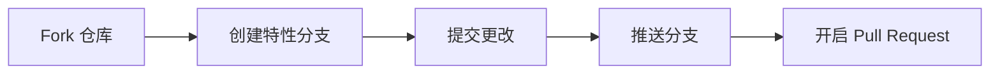

<div align="center">

# 🎯 多重人格决策机

**让5种人格为你展开理性与感性的精彩讨论，助你做出最适合自己的选择**

[](https://github.com/libinae/Decision-Machine)
[](https://github.com/libinae/Decision-Machine)
[](https://www.python.org/)
[](LICENSE)

[🔗 GitHub 仓库](https://github.com/libinae/Decision-Machine) · [📖 使用文档](docs/详细介绍.md) · [🚀 快速开始](#-快速开始)

---

</div>

## 📖 项目简介

**多重人格决策机** 是一款基于多智能体AI的决策辅助工具。当你面临两难抉择时，系统会创建 **5种具有不同思维模式的人格化身**，让它们围绕你的决策主题展开深入讨论，最终由综合人格协调各方观点，给出专业建议。

<br>

<table align="center">
<tr>
<td align="center" width="20%"><b>🚀 冒险人格</b></td>
<td align="center" width="20%"><b>🛡️ 保守人格</b></td>
<td align="center" width="20%"><b>❤️ 感性人格</b></td>
<td align="center" width="20%"><b>🧠 性人格</b></td>
<td align="center" width="20%"><b>⚖️ 综合人格</b></td>
</tr>
<tr>
<td>大胆激进<br>风险与收益成正比</td>
<td>谨慎稳健<br>重视风险控制</td>
<td>温暖共情<br>重视人际与责任</td>
<td>冷静分析<br>数据与逻辑说话</td>
<td>平衡全局<br>客观中立评估</td>
</tr>
</table>

<br>

---

## 🔄 决策流程

```
╔═══════════════════════════════════════════════════════════════╗
║                     阶段一：讨论与分组                          ║
╠═══════════════════════════════════════════════════════════════╣
  ① 综合人格分析辩题，确定正反方立场
  ② 4位人格依次表态，表达对决策的看法
  ③ 综合人格根据表态和人格特点进行分组，并说明理由
╚═══════════════════════════════════════════════════════════════╝
                              ↓
╔═══════════════════════════════════════════════════════════════╗
║                     阶段二：背景信息收集                         ║
╠═══════════════════════════════════════════════════════════════╣
  综合人格根据决策主题，动态生成5个针对性问题
  用户回答后，辩手会结合用户实际情况进行讨论
╚═══════════════════════════════════════════════════════════════╝
                              ↓
╔═══════════════════════════════════════════════════════════════╗
║                      阶段三：正式讨论                           ║
╠═══════════════════════════════════════════════════════════════╣
  ① 开篇陈词（正方一辩 → 反方一辩 → 反方二辩 → 正方二辩）
  ② 自由讨论（每方最多10次发言）
  ③ 双方结辩
  ④ 综合人格总结与建议
╚═══════════════════════════════════════════════════════════════╝
```

---

## ✨ 核心特性

### 🖥️ 双版本支持

| 版本 | 启动命令 | 特点 |
|:----:|:---------|:-----|
| **Web版** | `python -m uvicorn web.app:app --port 8000` | 浏览器访问 · 左右布局 · Markdown渲染 |
| **CLI版** | `python -m cli` | 终端运行 · 彩色输出 · 边框美化 |

### 🎨 Web版特色
- 📐 **左右布局** — 正方发言靠左（蓝色），反方发言靠右（红色），综合人格居中
- ⚡ **实时流式输出** — 发言内容逐字显示，自动滚动到最新内容
- 📜 **Markdown渲染** — 支持标题、列表、加粗等格式
- 🌙 **深色主题** — 护眼舒适的暗色界面

### 🧠 智能决策
- 🔍 **AI分析辩题** — 综合人格智能识别正反方立场
- 🏷️ **智能分组** — 根据人格特点和表态自动分配正反方
- ❓ **动态问题生成** — 根据决策主题生成针对性背景问题
- 🎭 **人格一致性** — 每个角色保持独特思维风格
- 💬 **上下文理解** — 辩手能看到完整讨论历史

### ⚡ 高效执行
| 指标 | 数值 |
|:----:|:----:|
| 全程时间 | ~2-3分钟 |
| 自由讨论 | 20轮（每方10次） |
| 报告格式 | Markdown |

---

## 🚀 快速开始

### 📋 环境要求

- Python 3.10+
- DashScope API Key（阿里云）

### 🔧 安装依赖

```bash
# 克隆项目
git clone https://github.com/libinae/Decision-Machine.git
cd Decision-Machine

# 安装依赖
pip install -e .
```

或手动安装核心依赖：

```bash
pip install agentscope pydantic fastapi uvicorn websockets python-dotenv
```

### 🔑 配置API

在项目根目录创建 `.env` 文件：

```bash
# 复制示例配置
cp .env.example .env

# 编辑 .env，填入你的 API Key
DASHSCOPE_API_KEY=your-api-key-here
```

### ▶️ 运行程序

<table>
<tr>
<td><b>Web版（推荐）</b></td>
<td><b>CLI版</b></td>
</tr>
<tr>
<td>

```bash
python -m uvicorn web.app:app \
  --host 0.0.0.0 --port 8000
```

访问 http://localhost:8000

</td>
<td>

```bash
python -m cli
```

在终端中交互

</td>
</tr>
</table>

### ⚙️ 配置参数

| 参数 | 说明 | 默认值 |
|:-----|:-----|:------:|
| `DASHSCOPE_API_KEY` | DashScope API密钥（必需） | — |
| `DM_MODEL_NAME` | 使用的模型名称 | `qwen3.5-plus` |
| `DECISION_MAX_ROUNDS` | 每方发言轮次 | `10` |

---

## 🎯 适用场景

| 场景类型 | 示例决策主题 |
|:--------:|:------------|
| 💼 **职业发展** | 我应该辞职创业还是继续上班？ |
| 💰 **投资理财** | 我应该买房还是租房？ |
| 🏠 **生活抉择** | 我应该去大城市发展还是留在家乡？ |
| 📚 **学业规划** | 我应该考研还是直接工作？ |
| 💕 **情感决策** | 我应该继续这段感情还是放手？ |

---

## 📁 项目结构

```
DecisionMachineCC/
├── 📂 src/decision_machine/     # 核心模块
│   ├── 📂 agents/               # 智能体模块
│   │   ├── personas.py         # 五重人格定义
│   │   └── factory.py          # Agent工厂
│   ├── 📂 engine/               # 决策引擎
│   │   ├── debate.py           # 主引擎
│   │   ├── grouping.py         # 分组逻辑
│   │   └── phases.py           # 阶段实现
│   ├── 📂 ui/                   # 用户界面
│   │   ├── terminal.py         # 终端UI
│   │   └── streaming.py        # 流式输出
│   ├── 📂 tools/                # 工具模块
│   │   └── web_search.py       # 网络搜索
│   ├── types.py                # 类型定义
│   ├── config.py               # 配置管理
│   └── export.py               # 报告导出
│
├── 📂 web/                      # Web版本
│   ├── app.py                  # FastAPI应用
│   ├── 📂 api/routes.py        # API路由
│   ├── 📂 ui/                   # Web UI组件
│   └── 📂 static/               # 静态文件
│
├── 📂 cli/                      # 命令行入口
├── 📂 tests/                    # 单元测试
├── pyproject.toml              # 项目配置
└── .env.example                # 环境变量示例
```

---

## 🔧 技术栈

<table align="center">
<tr>
<td align="center"><b>多智能体框架</b></td>
<td align="center"><b>LLM服务</b></td>
<td align="center"><b>大语言模型</b></td>
<td align="center"><b>Web框架</b></td>
<td align="center"><b>实时通信</b></td>
</tr>
<tr>
<td align="center">


</td>
<td align="center">


</td>
<td align="center">


</td>
<td align="center">


</td>
<td align="center">


</td>
</tr>
</table>

---

## 📝 更新日志

<details>
<summary><b>点击查看历史版本</b></summary>

### v2.2 (2026-03-31)
- ✨ 新增Web版本，支持浏览器访问
- 🎨 左右布局显示正反方发言，综合人格居中
- 📜 Markdown渲染支持
- 🔄 实时流式输出，自动滚动
- 🎯 优化人格提示词，定位为"决策顾问"
- 🧠 综合人格动态生成背景问题
- 🔍 新增网络搜索功能

### v2.1 (2026-03-26)
- 模型升级为 qwen3.5-plus
- 全流程流式输出
- 修复中文/emoji边框对齐问题
- 中文JSON key输出

### v2.0 (2026-03-26)
- 基于 AgentScope 重构
- 模块化架构设计
- DashScope 流式输出支持
- LLM驱动的智能分组

### v1.0 (2024-03-24)
- 初始版本发布

</details>

---

## 🤝 贡献指南

欢迎提交 Issue 和 Pull Request！



**贡献流程：**
1. 🍴 Fork 本仓库
2. 🌿 创建特性分支 (`git checkout -b feature/AmazingFeature`)
3. ✍️ 提交更改 (`git commit -m 'Add some AmazingFeature'`)
4. 📤 推送到分支 (`git push origin feature/AmazingFeature`)
5. 🔀 开启 Pull Request

---

<div align="center">

## 📄 License

本项目采用 **MIT License** 开源协议

---

<br>

**🎯 多重人格决策机**

*让理性的分析与感性的共鸣，帮你做出最好的选择*

<br>

[](https://github.com/libinae/Decision-Machine)
[](https://github.com/libinae/Decision-Machine)

<br>

*如果这个项目对你有帮助，请给一个 ⭐ Star 支持一下！*

</div>