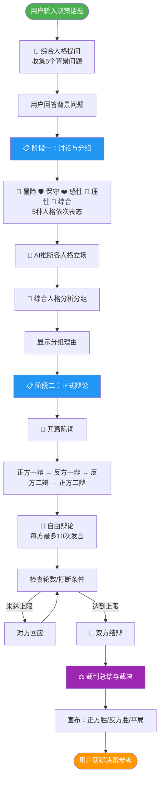

# 🎯 多重人格决策机 — Agent 详细介绍

## 一句话介绍

**多重人格决策机** — 一款基于多智能体AI的辩论式决策辅助工具，让5种人格化身围绕你的两难抉择展开激烈辩论，帮你从多角度审视问题，做出最适合自己的决定。

---

## 痛点故事

> 李明站在35岁的路口，手里攥着两份截然不同的人生剧本。
>
> 左边是干了8年的互联网大厂，稳定体面，年薪60万，但晋升的天花板已经开始压下来，每天重复的工作让他觉得自己在"慢性凋零"。
>
> 右边是他酝酿了2年的创业项目，做AI驱动的智能办公SaaS，市场需求已经过验证，几个投资人也有意向，但需要他辞职全力以赴。
>
> 他问遍了身边的朋友：有人说"都35了，别折腾了"，有人说"再不冲就来不及了"。他问父母，父母说"你自己决定"；问妻子，妻子说"我支持你任何选择"。
>
> **没人能给答案，因为没人能站在他的鞋子里思考。**
>
> 直到他遇到了多重人格决策机——一个能让他同时听到"激进冒险派"、"稳健保守派"、"情感共鸣派"、"理性分析派"四种声音的工具。它们不是给建议，而是**辩论**。通过辩论，李明清晰地看见了自己的恐惧、期望和真正的优先级。
>
> 最终他自己做出了选择，而这个选择，是真正属于"他自己的"。

---

## 核心功能

| 功能 | 说明 |
|------|------|
| 🧠 **5种人格辩论** | 冒险、保守、感性、理性、综合裁判，覆盖多元思维模型 |
| 🔄 **智能分组** | AI裁判根据各人格立场自动分配正反方，确保辩论张力 |
| ❓ **背景信息收集** | 辩论前收集你的具体情况，让辩手给出针对性建议 |
| ⚡ **真·流式输出** | 逐Token实时显示，沉浸式观看辩论过程 |
| 🏆 **专业裁判裁决** | 综合人格综合双方论点，给出有深度的裁决和建议 |

---

## 使用效果

| 维度 | 数据 |
|------|------|
| 决策思考时间 | 从"想了一周没结果" → **3分钟获取多角度分析** |
| 决策覆盖维度 | 从"非黑即白" → **5种思维视角全面审视** |
| 使用门槛 | 零学习成本，输入决策话题即可 |
| 适用场景 | 职业选择、投资决策、生活纠结、团队讨论 |

---

## 使用方式

### 环境准备

```bash
# 克隆项目
git clone <repo_url>
cd DecisionMachine

# 安装依赖
pip install agentscope pydantic

# 配置API Key（阿里云DashScope）
export DASHSCOPE_API_KEY="your-api-key"
```

### 运行方式

```bash
# 方式一：交互式运行
python -m cli

# 方式二：命令行参数
python -m cli "我应该辞职创业还是继续上班？"

# 可选配置
export DM_MODEL_NAME="qwen3.5-plus"    # 使用的模型
export DECISION_MAX_ROUNDS=10           # 自由辩论轮数
```

### 使用流程

1. **输入决策话题**：例如"我应该去大城市还是留在家乡？"
2. **回答5个背景问题**：帮助AI更懂你的具体情况
3. **观看辩论**：
   - 5种人格表态，选择支持正方或反方
   - AI裁判分析并给出分组理由
   - 正式辩论：开篇陈词 → 自由辩论 → 结辩
4. **获取裁决**：综合人格给出最终建议

---

## 辩论流程图



### 流程详解

| 阶段 | 步骤 | 说明 |
|------|------|------|
| **准备阶段** | 用户输入话题 | 用户输入两难决策问题 |
| | 背景Q&A | 🔮 综合人格提问5个问题，了解用户具体情况 |
| **阶段一** | 人格表态 | 5种人格依次表达对辩题的看法和倾向 |
| | 智能分组 | 🔮 综合人格根据立场和性格分配正反方 |
| | 显示理由 | 展示分组依据和考量 |
| **阶段二** | 开篇陈词 | 四位辩手按顺序发表立论 |
| | 自由辩论 | 正反双方你来我往，激烈交锋 |
| | 双方结辩 | 每方最后总结核心论点 |
| | 裁判裁决 | 🔮 综合人格总结辩论，给出最终建议 |

---

## 界面预览

```
╔════════════════════════════════════════════════════════════╗
║                       🎯 多人格决策                        ║
║                                                            ║
║ 决策主题：我应该辞职创业还是继续上班？                      ║
╚════════════════════════════════════════════════════════════╝

    🚀 冒险人格：我的第一反应是：安稳是最大的陷阱！我坚定支持正方...
    🛡️ 保守人格：我的第一反应是警惕：一旦切断工资这条现金流...
    ❤️ 感性人格：听到这个抉择，我首先感受到的是一份沉甸甸的期待...
    🧠 理性人格：我的第一反应是拒绝二元对立，转而评估期望值...
    🔮 综合人格：面对此辩题，我拒绝非黑即白的二元对立...

  ━━━━━━━━━━━━━━━━━━━━━━━━━━━━━━━━━━━━━━━━━━━━━━━━━━
    分组理由
    正方一辩由🚀冒险人格担任，因其激进特质最适合...
  ━━━━━━━━━━━━━━━━━━━━━━━━━━━━━━━━━━━━━━━━━━━━━━━━━━

  ○ 第1步：🚀 正方一辩：
各位评委、对方辩友，大家好！我是正方一辩...
（流式输出中...）

  ● 第1步：🛡️ 反方一辩：
我方坚定支持继续上班。数据显示...
（流式输出中...）

  ⚖️ 裁判总结：
    根据双方辩论表现，我宣布...

╔══════════════════════════════════════════════════╗
║               🤝 裁决结果：平局！                ║
╚══════════════════════════════════════════════════╝
```

---

## 技术架构

```
┌─────────────────────────────────────────────────────────┐
│                    用户输入决策话题                       │
└─────────────────────────────────────────────────────────┘
                            ↓
┌─────────────────────────────────────────────────────────┐
│              AgentScope 多智能体框架                       │
├─────────────────────────────────────────────────────────┤
│  🚀 冒险人格  │  🛡️ 保守人格  │  ❤️ 感性人格  │  🧠 理性人格  │
│  Agent        │  Agent        │  Agent        │  Agent        │
└─────────────────────────────────────────────────────────┘
                            ↓
┌─────────────────────────────────────────────────────────┐
│                   🔮 综合人格（裁判）                       │
│         智能分组 + 背景Q&A + 最终裁决                      │
└─────────────────────────────────────────────────────────┘
                            ↓
┌─────────────────────────────────────────────────────────┐
│                    流式输出到终端                          │
└─────────────────────────────────────────────────────────┘
```

---

## 真实用户评价

> "之前纠结了两个月要不要转行，用了这个工具之后，3分钟就看清楚了自己真正担心的是什么。不是AI帮我做了决定，而是辩论过程让我自己找到了答案。"
> — 产品经理小王

> "给创业团队做战略决策用，大家观点不一样的时候，让AI先辩一轮，我们再讨论，效率高多了。"
> — 创业公司CEO张总

> "最神奇的是保守派和冒险派吵架的时候，会冒出一些我自己都没想到的论点。很像和自己内心的两个声音对话。"
> — 互联网从业者李明

---

**🎯 多人格决策 — 让理性的分析与感性的共鸣，帮你做出最好的选择**
